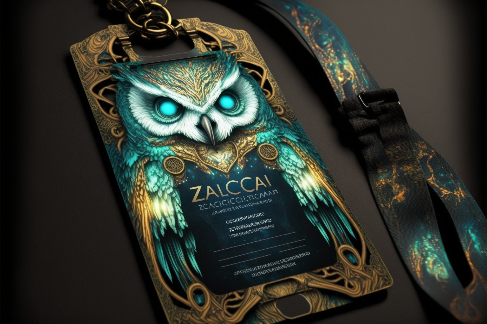

# Zodiac Access Card Module

The Zodiac Access Card module grants the holder of a given NFT unilateral control of an avatar (probably a Safe).
The module is compatible with any ERC721 or ERC1155 token, allowing any NFT to be used as an access card for a safe.
This repo also includes an access card NFT, an ERC721 token with a free and permissionless mint function so anyone can easily spin up new NFT access cards for safes.
Some potential use-cases for this include:
* Giving transient control of safes to protocols that interact with tokens (bridges, exchanges, etc)
* Token-gated access to safes (best used in concert with the [Roles Mod](https://github.com/gnosis/zodiac-modifier-roles))
* Tokenizing control of a safe

### License

Created under the [LGPL-3.0+ license](LICENSE).

### Audits

These contracts have not yet been audited.

### Security and Liability

All contracts are WITHOUT ANY WARRANTY; without even the implied warranty of MERCHANTABILITY or FITNESS FOR A PARTICULAR PURPOSE.
